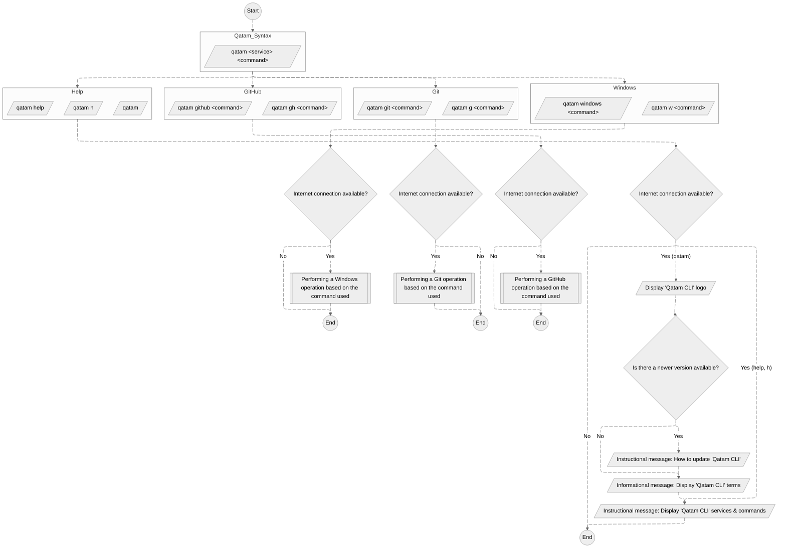

# Qatam CLI


## Tabla de contenido

- [Qatam CLI](#qatam-cli)
  - [Tabla de contenido](#table-of-content)
  - [Introducción](#introduction)
  - [Diagrama de Qatam CLI](#qatam-cli-diagram)
  - [Requisitos previos](#prerequisites)
    - [Para el uso de **Qatam CLI**](#for-qatam-cli-usage)
    - [Para el uso de operaciones de **Git**](#for-git-operations-usage)
    - [Para el uso de operaciones de **GitHub**](#for-github-operations-usage)
  - [Instalación](#install)
  - [Actualizar](#update)
  - [Desinstalar](#uninstall)
  - [Uso](#usage)
  - [Lista de servicios de **Qatam CLI**](#list-of-qatam-cli-services)
  - [Lista de comandos de **Qatam CLI**](#list-of-qatam-cli-commands)
  - [Estado actual](#current-status)
  - [Soporte](#support)
  - [Licencia](#license)

## Introducción

**Qatam CLI** es una herramienta que combina comandos de diversos servicios en una única interfaz de línea de comandos (CLI), permitiendo a los desarrolladores centrarse en su trabajo real y aumentando la productividad.

**Qatam CLI** gestiona diferentes **_Servicios_**:

1. Sistema operativo Windows
2. Git
3. GitHub

## Diagrama de Qatam CLI



## Requisitos previos

### Para el uso de **Qatam CLI**

1. Sistema operativo **Windows** [**10**](https://www.microsoft.com/en-us/software-download/windows10)/[**11**](https://www.microsoft.com/en-us/software-download/windows11)

2. **WinGet**

   - La herramienta de línea de comandos **WinGet** viene incluida de forma predeterminada con Windows 11 y las versiones modernas de Windows 10 como el Instalador de Aplicaciones (App Installer).

     - Verificar el estado de instalación / versión de WinGet:

       ```powershell
       winget -v
       ```

     - Si no está instalado, puede instalarlo a través de [**Microsoft Store (Recomendado)**](https://www.microsoft.com/p/app-installer/9nblggh4nns1) o consultar [**otras soluciones**](https://github.com/microsoft/winget-cli).

3. **PowerShell 7.4**

   - Verificar el estado de instalación de PowerShell 7.4:

     - Escriba en el _"cuadro de búsqueda de Windows"_ **PowerShell 7**.

       - Alternativamente, verifique que **PowerShell 7** esté instalado de forma predeterminada en `C:\Program Files\PowerShell\7`.

     - Abra **PowerShell 7** y escriba `$PSVersionTable.PSVersion` para verificar la versión.

   - Si no está instalado, puede instalarlo a través de **WinGet CLI**:
     - Instale la última versión de **PowerShell 7**:
       ```powershell
       winget install --id Microsoft.PowerShell --source winget
       ```
     - O consulte [**otras soluciones**](https://learn.microsoft.com/en-us/powershell/scripting/install/installing-powershell-on-windows?view=powershell-7.4)

### Para el uso de operaciones de **Git**

- [**Winget**](#prerequisites)

### Para el uso de operaciones de **GitHub**

- **Git** (mínimo **V 2.27.0**)

  - Verificar el estado de instalación / versión de Git:

    ```powershell
    git -v
    ```

- **GCM** (Git Credential Manager)
  - De forma predeterminada, con **Git V 2.27.0** y versiones posteriores, GCM está incluido.

> [!NOTE]
> Ambos, **Git** y **GCM**, pueden instalarse utilizando **Qatam CLI**. Por lo tanto, SOLO necesita considerar los requisitos de **Qatam CLI**.

## Instalación

1. Abra PowerShell 7.4
2. Ejecute lo siguiente:

   ```powershell
   Install-Module -Name qatam-cli
   ```

> [!NOTE]
> Se instalará en el directorio `"C:\Users\Your-User-Name\Documents\PowerShell\Modules"` o `"C:\Users\Your-User-Name\OneDrive\Documents\PowerShell\Modules"`.

## Actualización

1. Abra PowerShell 7.4
2. Ejecute lo siguiente:

   ```powershell
   Update-Module -Name qatam-cli
   ```

## Desinstalación

1. Abra PowerShell 7.4
2. Ejecute lo siguiente:

   ```powershell
   Uninstall-Module -Name qatam-cli
   ```

## Uso

| Comando                        | Descripción                                                           |
| :----------------------------- | --------------------------------------------------------------------- |
| `qatam [h \| help]` o `qatam`  | Muestra todos los [**servicios**](#list-of-qatam-cli-services) de **Qatam-CLI** |
| `qatam <service> [h \| help]`  | Muestra todos los [**comandos**](#list-of-qatam-cli-commands) del servicio     |
| `qatam <service> <command>`    | Ejecuta el comando                                                    |

## Lista de servicios de **Qatam CLI**

| Comando        | Descripción                          |
| :------------- | ------------------------------------ |
| `w \| windows` | Gestionar operaciones del sistema operativo Windows |
| `g \| git`     | Gestionar operaciones de Git           |
| `gh \| github` | Gestionar operaciones de GitHub        |

## Lista de comandos de **Qatam CLI**

[Operaciones para el sistema operativo Windows](https://github.com/AnasAlhwid/qatam-cli/blob/main/docs/windows-commands.md#operations-for-windows-os)

[Operaciones para Git](https://github.com/AnasAlhwid/qatam-cli/blob/main/docs/git-commands.md#operations-for-git)

[Operaciones para GitHub](https://github.com/AnasAlhwid/qatam-cli/blob/main/docs/github-commands.md#operations-for-github)

## Estado actual

Este proyecto se encuentra actualmente en desarrollo y pruebas. Hay tres etapas principales en curso: **_Sistema operativo Windows_**, **_Git_** y **_GitHub_**. Una vez completadas estas etapas, comenzará la etapa de CI/CD, centrándose en el soporte comunitario, corrección de errores, mejoras en la experiencia del usuario, nuevos comandos y creación de funciones.

## Soporte

<a href="https://www.buymeacoffee.com/AnasAlhwid" target="_blank"></a>

## Licencia

[**Licencia Pública General Afirmativa de GNU v3.0**](https://github.com/AnasAlhwid/qatam-cli/blob/main/LICENSE)
