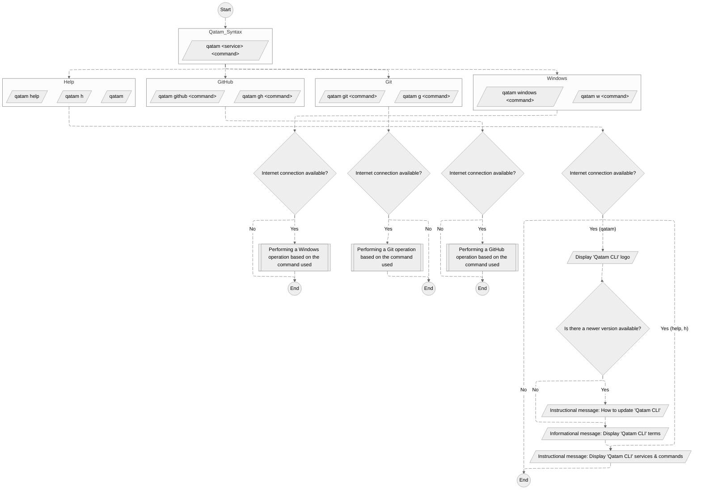

# Qatam CLI


## Table of Content

- [Qatam CLI](#qatam-cli)
  - [Table of Content](#table-of-content)
  - [Introduction](#introduction)
  - [Qatam CLI diagram](#qatam-cli-diagram)
  - [Prerequisites](#prerequisites)
    - [For **Qatam CLI** usage](#for-qatam-cli-usage)
    - [For **Git** operations usage](#for-git-operations-usage)
    - [For **GitHub** operations usage](#for-github-operations-usage)
  - [Install](#install)
  - [Update](#update)
  - [Uninstall](#uninstall)
  - [Usage](#usage)
  - [List of **Qatam CLI** services](#list-of-qatam-cli-services)
  - [List of **Qatam CLI** commands](#list-of-qatam-cli-commands)
  - [Current status](#current-status)
  - [Support](#support)
  - [License](#license)

## Introduction

**Qatam CLI** is a tool that combines commands from various services into a single CLI, allowing developers to focus on their actual work and increasing productivity.

**Qatam CLI** manages different **_Services_**:

1. Windows OS
2. Git
3. GitHub

## Qatam CLI diagram



## Prerequisites

### For **Qatam CLI** usage

1. **Windows** [**10**](https://www.microsoft.com/en-us/software-download/windows10)/[**11**](https://www.microsoft.com/en-us/software-download/windows11) **OS**

2. **WinGet**

   - The **WinGet** command-line tool is bundled with Windows 11 and modern versions of Windows 10 by default as the App Installer.

     - Check WinGet installation status / version:

       ```powershell
       winget -v
       ```

     - If it's not installed you may install it via [**Microsoft Store (Recommended)**](https://www.microsoft.com/p/app-installer/9nblggh4nns1) or see [**other solutions**](https://github.com/microsoft/winget-cli).

3. **PowerShell 7.4**

   - Check PowerShell 7.4 installation status:

     - Type in the _"Windows search box"_ **PowerShell 7**.

       - Alternatively, check by default **PowerShell 7** is installed in `C:\Program Files\PowerShell\7`.

     - Open **PowerShell 7** & type `$PSVersionTable.PSVersion` to check the version.

   - If it's not installed, you may install it via **WinGet CLI**:
     - Install the latest **PowerShell 7** version:
       ```powershell
       winget install --id Microsoft.PowerShell --source winget
       ```
     - Or see [**other solutions**](https://learn.microsoft.com/en-us/powershell/scripting/install/installing-powershell-on-windows?view=powershell-7.4)

### For **Git** operations usage

- [**Winget**](#prerequisites)

### For **GitHub** operations usage

- **Git** (least **V 2.27.0**)

  - Check Git installation status / version:

    ```powershell
    git -v
    ```

- **GCM** (Git Credential Manager)
  - By default, with **Git V 2.27.0** & later, GCM is included.

> [!NOTE]
> Both **Git** & **GCM** can be installed using the **Qatam CLI**. Thus, you ONLY need to consider the **Qatam CLI** requirements.

## Install

1. Open PowerShell 7.4
2. Run the following:

   ```powershell
   Install-Module -Name qatam-cli
   ```

> [!NOTE]
> It will be installed under `"C:\Users\Your-User-Name\Documents\PowerShell\Modules"` or `"C:\Users\Your-User-Name\OneDrive\Documents\PowerShell\Modules"` directory.

## Update

1. Open PowerShell 7.4
2. Run the following:

   ```powershell
   Update-Module -Name qatam-cli
   ```

## Uninstall

1. Open PowerShell 7.4
2. Run the following:

   ```powershell
   Uninstall-Module -Name qatam-cli
   ```

## Usage

| Command                        | Description                                                           |
| :----------------------------- | --------------------------------------------------------------------- |
| `qatam [h \| help]` Or `qatam` | Display all **Qatam-CLI** [**services**](#list-of-qatam-cli-services) |
| `qatam <service> [h \| help]`  | Display all service's [**commands**](#list-of-qatam-cli-commands)     |
| `qatam <service> <command>`    | Execute the command                                                   |

## List of **Qatam CLI** services

| Command        | Description                  |
| :------------- | ---------------------------- |
| `w \| windows` | Manage Windows OS Operations |
| `g \| git`     | Manage Git Operations        |
| `gh \| github` | Manage GitHub Operations     |

## List of **Qatam CLI** commands

[Operations for Windows OS](https://github.com/AnasAlhwid/qatam-cli/blob/main/docs/windows-commands.md#operations-for-windows-os)

[Operations for Git](https://github.com/AnasAlhwid/qatam-cli/blob/main/docs/git-commands.md#operations-for-git)

[Operations for GitHub](https://github.com/AnasAlhwid/qatam-cli/blob/main/docs/github-commands.md#operations-for-github)

## Current status

This project is currently under development and testing. There are three main stages in progress: **_Windows OS_**, **_Git_**, and **_GitHub_**. Once these stages are completed, the CI/CD stage will begin, focusing on community support, bug fixes, user experience enhancements, new commands, and feature creation.

## Support

<a href="https://www.buymeacoffee.com/AnasAlhwid" target="_blank"></a>

## License

[**GNU Affero General Public License v3.0**](https://github.com/AnasAlhwid/qatam-cli/blob/main/LICENSE)
