## Table of Content

- [Table of Content](#table-of-content)
- [Qatam's Git Diagram](#qatams-git-diagram)
- [Operations for Git](#operations-for-git)

## Qatam's Git Diagram

```mermaid
---
config:
  markdownAutoWrap: false
  theme: neutral
  layout: elk
  elk:
    mergeEdges: true
    nodePlacementStrategy: NETWORK_SIMPLEX
---

flowchart TB

subgraph Git_Syntax
    direction LR

    GitSyntax1[/"qatam git &lt;Command&gt;"/] ~~~ GitSyntax2[/"qatam g &lt;Command&gt;"/]
end

subgraph Check_Git_Version
    direction LR

    GitCommand1[/"qatam git version"/] ~~~ GitCommand2[/"qatam git v"/]
end

subgraph Update_Git
    direction LR

    GitCommand3[/"qatam git update"/] ~~~ GitCommand4[/"qatam git upd"/]
end

subgraph Install_Git
    direction LR

    GitCommand5[/"qatam git install"/] ~~~ GitCommand6[/"qatam git i"/]
end

subgraph Uninstall_Git
    direction LR

    GitCommand7[/"qatam git uninstall"/] ~~~ GitCommand8[/"qatam git uni"/]
end

subgraph Create_Local_Git_Repository
    direction LR

    GitCommand9[/"qatam git create"/] ~~~ GitCommand10[/"qatam git c"/]
end

subgraph Rename_Main_Branch
    direction LR

    GitCommand11[/"qatam git branch-name"/] ~~~ GitCommand12[/"qatam git bn"/]
end

subgraph Configure_Local_Git_Credentials
    direction LR

    GitCommand13[/"qatam git config-cred"/] ~~~ GitCommand14[/"qatam git cc"/]
end

subgraph Git_Help
    direction LR

    GitCommand15[/"qatam git"/] ~~~ GitCommand16[/"qatam g"/] ~~~ GitCommand17[/"qatam git help"/]  ~~~ GitCommand18[/"qatam g help"/]
end

Start(("Start")) mainL1@--> Git_Syntax
Git_Syntax mainL2@--> Check_Git_Version
Git_Syntax mainL3@--> Update_Git
Git_Syntax mainL4@--> Install_Git
Git_Syntax mainL5@--> Uninstall_Git
Git_Syntax mainL6@--> Create_Local_Git_Repository
Git_Syntax mainL7@--> Rename_Main_Branch
Git_Syntax mainL8@--> Configure_Local_Git_Credentials
Git_Syntax mainL9@--> Git_Help

mainL1@{ animate: true }
mainL2@{ animate: true }
mainL3@{ animate: true }
mainL4@{ animate: true }
mainL5@{ animate: true }
mainL6@{ animate: true }
mainL7@{ animate: true }
mainL8@{ animate: true }
mainL9@{ animate: true }


%% Check Git version.
Check_Git_Version gitVersionL1@--> gitVersionDecisionId1{"`Internet connection available?`"}
gitVersionDecisionId1 gitVersionL2@-- No --> gitVersionEnd(("End"))

gitVersionDecisionId1 gitVersionL3@-- Yes --> gitVersionDecisionId2{"`Is Git installed?`"}
gitVersionDecisionId2 gitVersionL4@-- Yes --> gitVersionIOId1[/"`Informational message: Display the locally installed version of Git`"/] gitVersionL5@--> gitVersionEnd
gitVersionDecisionId2 gitVersionL6@-- No --> gitVersionIOId2[/"`Instructional message: How to install Git`"/] gitVersionL7@--> gitVersionEnd

gitVersionL1@{ animate: true }
gitVersionL2@{ animate: true }
gitVersionL3@{ animate: true }
gitVersionL4@{ animate: true }
gitVersionL5@{ animate: true }
gitVersionL6@{ animate: true }
gitVersionL7@{ animate: true }


%% Update Git.
Update_Git gitUpdateL1@--> gitUpdateDecisionId1{"`Internet connection available?`"}
gitUpdateDecisionId1 gitUpdateL2@-- No --> gitUpdateEnd(("End"))

gitUpdateDecisionId1 gitUpdateL3@-- Yes --> gitUpdateDecisionId2{"`Is WinGet installed?`"}
gitUpdateDecisionId2 gitUpdateL4@-- Yes --> gitUpdateDecisionId3{"`Is Git installed?`"}
gitUpdateDecisionId2 gitUpdateL5@-- No --> gitUpdateIOId1[/"`Instructional message: How to install WinGet`"/] gitUpdateL6@--> gitUpdateEnd

gitUpdateDecisionId3 gitUpdateL7@-- Yes --> gitUpdateProcessId1["`Update the locally installed version of Git`"] gitUpdateL8@--> gitUpdateEnd
gitUpdateDecisionId3 gitUpdateL9@-- No --> gitUpdateIOId3[/"`Instructional message: How to install Git`"/] gitUpdateL10@--> gitUpdateEnd

gitUpdateL1@{ animate: true }
gitUpdateL2@{ animate: true }
gitUpdateL3@{ animate: true }
gitUpdateL4@{ animate: true }
gitUpdateL5@{ animate: true }
gitUpdateL6@{ animate: true }
gitUpdateL7@{ animate: true }
gitUpdateL8@{ animate: true }
gitUpdateL9@{ animate: true }
gitUpdateL10@{ animate: true }


%% Install Git.
Install_Git gitInstallL1@--> gitInstallDecisionId1{"`Internet connection available?`"}
gitInstallDecisionId1 gitInstallL2@-- No --> gitInstallEnd(("End"))

gitInstallDecisionId1 gitInstallL3@-- Yes --> gitInstallDecisionId2{"`Is WinGet installed?`"}
gitInstallDecisionId2 gitInstallL4@-- Yes --> gitInstallDecisionId3{"`Is Git installed?`"}
gitInstallDecisionId2 gitInstallL5@-- No --> gitInstallIOId1[/"`Instructional message: How to install WinGet`"/] gitInstallL6@--> gitInstallEnd

gitInstallDecisionId3 gitInstallL7@-- Yes --> gitInstallIOId2[/"`Informational message: Git is already installed locally`"/] gitInstallL8@--> gitInstallEnd
gitInstallDecisionId3 gitInstallL9@-- No --> gitInstallProcessId1["`Install Git locally`"] gitInstallL10@--> gitInstallEnd

gitInstallL1@{ animate: true }
gitInstallL2@{ animate: true }
gitInstallL3@{ animate: true }
gitInstallL4@{ animate: true }
gitInstallL5@{ animate: true }
gitInstallL6@{ animate: true }
gitInstallL7@{ animate: true }
gitInstallL8@{ animate: true }
gitInstallL9@{ animate: true }
gitInstallL10@{ animate: true }


%% Uninstall Git.
Uninstall_Git gitUninstallL1@--> gitUninstallDecisionId1{"`Internet connection available?`"}
gitUninstallDecisionId1 gitUninstallL2@-- No --> gitUninstallEnd(("End"))

gitUninstallDecisionId1 gitUninstallL3@-- Yes --> gitUninstallDecisionId2{"`Is WinGet installed?`"}
gitUninstallDecisionId2 gitUninstallL4@-- Yes --> gitUninstallDecisionId3{"`Is Git installed?`"}
gitUninstallDecisionId2 gitUninstallL5@-- No --> gitUninstallIOId1[/"`Instructional message: How to install WinGet`"/] gitUninstallL6@--> gitUninstallEnd

gitUninstallDecisionId3 gitUninstallL7@-- Yes --> gitUninstallProcessId1["`Uninstall the locally installed version of Git`"] gitUninstallL8@--> gitUninstallEnd
gitUninstallDecisionId3 gitUninstallL9@-- No --> gitUninstallIOId2[/"`Informational message: Git is not installed locally`"/] gitUninstallL10@--> gitUninstallEnd

gitUninstallL1@{ animate: true }
gitUninstallL2@{ animate: true }
gitUninstallL3@{ animate: true }
gitUninstallL4@{ animate: true }
gitUninstallL5@{ animate: true }
gitUninstallL6@{ animate: true }
gitUninstallL7@{ animate: true }
gitUninstallL8@{ animate: true }
gitUninstallL9@{ animate: true }
gitUninstallL10@{ animate: true }


%% Create Local Git Repository.
Create_Local_Git_Repository gitCreateLocalRepo1@--> gitCreateLocalRepoDecisionId1{"`Internet connection available?`"}
gitCreateLocalRepoDecisionId1 gitCreateLocalRepo2@-- No --> gitCreateLocalRepoEnd(("End"))
gitCreateLocalRepoDecisionId1 gitCreateLocalRepo3@-- Yes --> gitCreateLocalRepoDecisionId2{"`Is Git installed?`"}

gitCreateLocalRepoDecisionId2 gitCreateLocalRepo4@-- Yes --> gitCreateLocalRepoId1[[Performing a Windows OS operation 'get-dir']]
click gitCreateLocalRepoId1 href "https://github.com/AnasAlhwid/qatam-cli/blob/main/docs/windows-commands.md#qatams-windows-os-diagram" "Go to Windows OS Diagram section"

gitCreateLocalRepoId1 gitCreateLocalRepo5@--> gitCreateLocalRepoDecisionId3{"`Does a local Git repository exist in this directory?`"}
gitCreateLocalRepoDecisionId3 gitCreateLocalRepo6@-- Yes --> gitCreateLocalRepoDecisionId4{"`Overwrite or continue with the existing local Git repository?`"}
gitCreateLocalRepoDecisionId3 gitCreateLocalRepo7@-- No --> gitCreateLocalRepoProcessId5["`Create a new local Git repository`"]

gitCreateLocalRepoDecisionId4 gitCreateLocalRepo8@-- Overwrite --> gitCreateLocalRepoProcessId1["`Overwrite the existing local Git repository`"]
gitCreateLocalRepoProcessId1 gitCreateLocalRepo9@--> gitCreateLocalRepoDecisionId5{"`<br><br>(Optional) Which file(s) do you want to create for the local Git environment?<br>(1) .gitignore<br>(2) .gitattributes<br>(3) .env`"}
gitCreateLocalRepoDecisionId4 gitCreateLocalRepo10@-- Continue --> gitCreateLocalRepoDecisionId5

gitCreateLocalRepoProcessId5 gitCreateLocalRepo11@--> gitCreateLocalRepoDecisionId5

gitCreateLocalRepoDecisionId5 gitCreateLocalRepo12@-- Skip selection --> gitCreateLocalRepoEnd
gitCreateLocalRepoDecisionId5 gitCreateLocalRepo13@-- Select --> gitCreateLocalRepoId2[[Performing a Windows OS operation 'create-dir']] gitCreateLocalRepo14@--> gitCreateLocalRepoEnd
click gitCreateLocalRepoId2 href "https://github.com/AnasAlhwid/qatam-cli/blob/main/docs/windows-commands.md#qatams-windows-os-diagram" "Go to Windows OS Diagram section"

gitCreateLocalRepoDecisionId2 gitCreateLocalRepo15@-- No --> gitCreateLocalRepoIOId2[/"`Instructional message: How to install Git`"/] gitCreateLocalRepo16@--> gitCreateLocalRepoEnd

gitCreateLocalRepo1@{ animate: true }
gitCreateLocalRepo2@{ animate: true }
gitCreateLocalRepo3@{ animate: true }
gitCreateLocalRepo4@{ animate: true }
gitCreateLocalRepo5@{ animate: true }
gitCreateLocalRepo6@{ animate: true }
gitCreateLocalRepo7@{ animate: true }
gitCreateLocalRepo8@{ animate: true }
gitCreateLocalRepo9@{ animate: true }
gitCreateLocalRepo10@{ animate: true }
gitCreateLocalRepo11@{ animate: true }
gitCreateLocalRepo12@{ animate: true }
gitCreateLocalRepo13@{ animate: true }
gitCreateLocalRepo14@{ animate: true }
gitCreateLocalRepo15@{ animate: true }
gitCreateLocalRepo16@{ animate: true }


%% Rename Main Branch.
Rename_Main_Branch RenameBranchL1@--> renameBranchDecisionId1{"`Internet connection available?`"}
renameBranchDecisionId1 RenameBranchL2@-- No --> renameBranchEnd(("End"))
renameBranchDecisionId1 RenameBranchL3@-- Yes --> renameBranchDecisionId2{"`Is Git installed?`"}

renameBranchDecisionId2 RenameBranchL4@-- Yes --> renameBranchId1[[Performing a Windows OS operation 'get-dir']]
click renameBranchId1 href "https://github.com/AnasAlhwid/qatam-cli/blob/main/docs/windows-commands.md#qatams-windows-os-diagram" "Go to Windows OS Diagram section"

renameBranchId1 RenameBranchL5@--> renameBranchDecisionId3{"`Does a local Git repository exist in this directory?`"}
renameBranchDecisionId3 RenameBranchL6@-- Yes --> renameBranchIOId1[/"`Informational message: Display the existing name of the local Git repository`"/]
renameBranchDecisionId3 RenameBranchL7@-- No --> renameBranchIOId2[/"`Informational message: No local Git repository was found`"/] RenameBranchL8@--> renameBranchEnd

renameBranchIOId1 RenameBranchL9@--> renameBranchIOId3[/"`User input: New name for the main branch`"/] RenameBranchL10@--> renameBranchEnd

renameBranchDecisionId2 RenameBranchL11@-- No --> renameBranchIOId4[/"`Instructional message: How to install Git`"/] RenameBranchL12@--> renameBranchEnd

RenameBranchL1@{ animate: true }
RenameBranchL2@{ animate: true }
RenameBranchL3@{ animate: true }
RenameBranchL4@{ animate: true }
RenameBranchL5@{ animate: true }
RenameBranchL6@{ animate: true }
RenameBranchL7@{ animate: true }
RenameBranchL8@{ animate: true }
RenameBranchL9@{ animate: true }
RenameBranchL10@{ animate: true }
RenameBranchL11@{ animate: true }
RenameBranchL12@{ animate: true }


%% Git credential configuration.
Configure_Local_Git_Credentials gitCredentialL1@--> gitCredentialConfigurationDecisionId1{"`Internet connection available?`"}
gitCredentialConfigurationDecisionId1 gitCredentialL2@-- No --> gitCredentialConfigurationEnd(("End"))
gitCredentialConfigurationDecisionId1 gitCredentialL3@-- Yes --> gitCredentialConfigurationDecisionId2{"`Is Git installed?`"}

gitCredentialConfigurationDecisionId2 gitCredentialL4@-- Yes --> gitCredentialConfigurationId1[[Performing a Windows OS operation 'get-dir']]
click gitCredentialConfigurationId1 href "https://github.com/AnasAlhwid/qatam-cli/blob/main/docs/windows-commands.md#qatams-windows-os-diagram" "Go to Windows OS Diagram section"

gitCredentialConfigurationId1 gitCredentialL5@--> gitCredentialConfigurationDecisionId3{"`Does a local Git repository exist in this directory?`"}
gitCredentialConfigurationDecisionId3 gitCredentialL6@-- No --> gitCredentialConfigurationIOId1[/"`Informational message: No local Git repository was found`"/] gitCredentialL7@--> gitCredentialConfigurationEnd
gitCredentialConfigurationDecisionId3 gitCredentialL8@-- Yes --> gitCredentialConfigurationDecisionId4{"`Are all, one, or none of 'Username' and 'E-mail' configured?`"}

gitCredentialConfigurationDecisionId4 gitCredentialL9@-- All --> gitCredentialConfigurationIOId3[/"`Informational message: The local Git repository credentials are already configured`"/]

gitCredentialConfigurationIOId3 gitCredentialL10@--> gitCredentialConfigurationDecisionId5{"`Overwrite or continue with the configured credentials?`"}
gitCredentialConfigurationDecisionId5 gitCredentialL11@-- Overwrite --> gitCredentialConfigurationIOId4[/"`User input: Username & E-mail`"/] gitCredentialL12@--> gitCredentialConfigurationEnd
gitCredentialConfigurationDecisionId5 gitCredentialL13@-- Continue --> gitCredentialConfigurationEnd

gitCredentialConfigurationDecisionId4 gitCredentialL14@-- One  --> gitCredentialConfigurationIOId5[/"`Informational message: Only one of the credentials for the local Git repository is configured`"/]

gitCredentialConfigurationIOId5 gitCredentialL15@--> gitCredentialConfigurationDecisionId6{"`Set the missing credentials or overwrite all of them?`"}
gitCredentialConfigurationDecisionId6 gitCredentialL16@-- Set --> gitCredentialConfigurationIOId6[/"`User input: Username or E-mail`"/] gitCredentialL17@--> gitCredentialConfigurationEnd
gitCredentialConfigurationDecisionId6 gitCredentialL18@-- Overwrite --> gitCredentialConfigurationIOId7[/"`User input: Username & E-mail`"/] gitCredentialL19@--> gitCredentialConfigurationEnd

gitCredentialConfigurationDecisionId4 gitCredentialL20@-- None --> gitCredentialConfigurationIOId8[/"`User input: Username & E-mail`"/] gitCredentialL21@--> gitCredentialConfigurationEnd

gitCredentialConfigurationDecisionId2 gitCredentialL22@-- No --> gitCredentialConfigurationIOId9[/"`Instructional message: How to install Git`"/] gitCredentialL23@--> gitCredentialConfigurationEnd

gitCredentialL1@{ animate: true }
gitCredentialL2@{ animate: true }
gitCredentialL3@{ animate: true }
gitCredentialL4@{ animate: true }
gitCredentialL5@{ animate: true }
gitCredentialL6@{ animate: true }
gitCredentialL7@{ animate: true }
gitCredentialL8@{ animate: true }
gitCredentialL9@{ animate: true }
gitCredentialL10@{ animate: true }
gitCredentialL11@{ animate: true }
gitCredentialL12@{ animate: true }
gitCredentialL13@{ animate: true }
gitCredentialL14@{ animate: true }
gitCredentialL15@{ animate: true }
gitCredentialL16@{ animate: true }
gitCredentialL17@{ animate: true }
gitCredentialL18@{ animate: true }
gitCredentialL19@{ animate: true }
gitCredentialL20@{ animate: true }
gitCredentialL21@{ animate: true }
gitCredentialL22@{ animate: true }
gitCredentialL23@{ animate: true }


%% Git Help
Git_Help GitHelpL1@--> gitHelpDecisionId1{"`Internet connection available?`"}
gitHelpDecisionId1 GitHelpL2@-- No --> gitHelpEnd(("End"))
gitHelpDecisionId1 GitHelpL3@-- Yes --> gitHelpIOId1[/"`Instructional message: Display 'Git' commands`"/] GitHelpL4@--> gitHelpEnd

GitHelpL1@{ animate: true }
GitHelpL2@{ animate: true }
GitHelpL3@{ animate: true }
GitHelpL4@{ animate: true }
```

## Operations for Git

**Note**: Commands marked with (\*) are planned for future release and are NOT accessible yet.

| Command                  | Description                                                                                                                                                                                                                                                                                                                        |
| :----------------------- | ---------------------------------------------------------------------------------------------------------------------------------------------------------------------------------------------------------------------------------------------------------------------------------------------------------------------------------- |
| `v \| version`           | Display the locally installed version of Git                                                                                                                                                                                                                                                                                       |
| `upd \| update`          | Update the locally installed version of Git                                                                                                                                                                                                                                                                                        |
| `i \| install`           | Install Git locally                                                                                                                                                                                                                                                                                                                |
| `uni \| uninstall`       | Uninstall the locally installed version of Git                                                                                                                                                                                                                                                                                     |
| `c \| create`            | <ol> <li>Create a local Git repositroy</li> <li>(Optional) Create file(s) for the local Git repositroy environment:</li> <ul><li>[**.gitignore**](https://git-scm.com/docs/gitignore)</li> <li>[**.gitattributes**](https://git-scm.com/docs/gitattributes)</li> <li>[**.env**](https://dotenvx.com/docs/env-file)</li></ul> </ol> |
| `bn \| branch-name`      | Rename the local Git repository’s main branch                                                                                                                                                                                                                                                                                      |
| `cc \| config-cred`      | Configure the local Git repository's credentials (**Username** & **E-mail**)                                                                                                                                                                                                                                                       |
| \* `s \| seal`           | Stage and commit changes to the local Git repository                                                                                                                                                                                                                                                                               |
| \* `mb \| manage-branch` | <ol> <li>Create a new branch</li> <li>Switch between branches</li> <li>Delete a branch</li> </ol>                                                                                                                                                                                                                                  |
| `h \| help`              | Display Git commands                                                                                                                                                                                                                                                                                                               |
