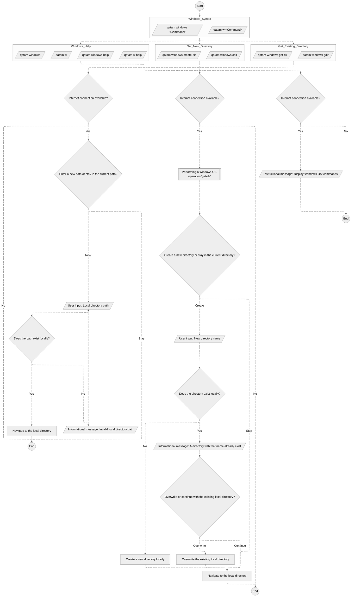

## Table of Content

- [Table of Content](#table-of-content)
- [Qatam's Windows OS Diagram](#qatams-windows-os-diagram)
- [Operations for Windows OS](#operations-for-windows-os)

## Qatam's Windows OS Diagram

## Operations for Windows OS

**Note**: Commands marked with (\*) are planned for future release and are NOT accessible yet.

| Command                 | Description                       |
| :---------------------- | --------------------------------- |
| `gdir \| get-dir`       | Check if a local directory exists |
| `cdir \| create-dir`    | Create a local directory          |
| \* `ddir \| delete-dir` | Delete a local directory          |
| `h \| help`             | Display Windows OS commands       |
